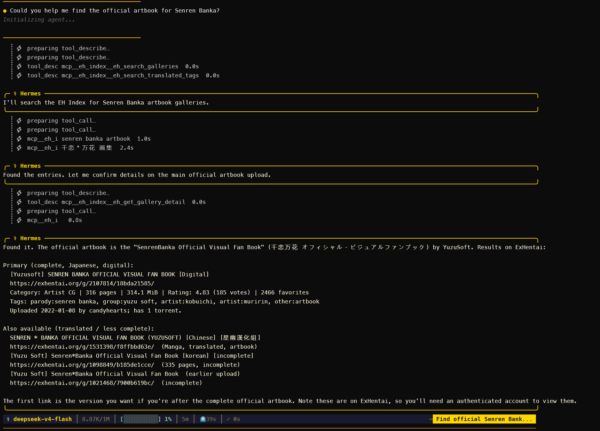

<div align="center">


# EH Index MCP

**用于搜索和浏览 E-Hentai / ExHentai 的只读 MCP 服务。**

[English](README.md) | **简体中文**

[](https://www.npmjs.com/package/eh-index-mcp)
[](https://nodejs.org/)
[](https://modelcontextprotocol.io/)
[](LICENSE)

搜索画廊、追踪版本链、解析图片页、读取元数据、翻译标签，并整理相关投稿，全程不会修改账号数据。

[快速开始](#快速开始) &middot; [功能概览](#功能概览) &middot; [工具目录](#工具目录) &middot; [身份认证](#身份认证) &middot; [参与开发](#参与开发)

</div>

---

## 功能概览

| | 能力 | 内容 |
| --- | --- | --- |
| **搜索** | 原生画廊搜索 | 支持 E-Hentai 查询语法、分类、过滤器、游标分页、SHA-1 搜索，以及不上传文件的本地图片哈希搜索 |
| **相似画廊** | 与 EhViewer 兼容的发现策略 | 从结构化标题中提取稳定标题，依次回退到精确标题、作者和上传者搜索 |
| **作品整理** | 作品、变体与系列 | 扫描多页结果，合并官方版本关系和语言变体，保留置信度与全部来源画廊 |
| **元数据** | 画廊与图片信息 | 官方元数据、标签、评论、版本比较、预览页、图片页链接和种子元数据 |
| **标签查询** | 中英文标签解析 | 通过 EhTagTranslation 查询翻译，并读取结构化 EHWiki 定义 |
| **账号数据** | 可选的认证读取 | 读取收藏分类、收藏详情、归档选项和 ExHentai 访问状态，不执行写操作 |

EH Index MCP 提供 **28 个只读工具**。它不会修改收藏、购买归档、下载画廊或上传本地文件。



## 快速开始

### 使用 npx 运行

```bash
npx -y eh-index-mcp
```

公开的 E-Hentai 搜索和元数据工具无需账号即可使用。

### 添加到 MCP 客户端

```json
{
  "mcpServers": {
    "eh-index": {
      "command": "npx",
      "args": ["-y", "eh-index-mcp"]
    }
  }
}
```

保存配置后重启客户端。服务通过 stdio 通信，标准输出只写入协议消息。

<details>
<summary><strong>全局安装</strong></summary>

```bash
npm install --global eh-index-mcp
eh-index-mcp
```

需要 Node.js 20.3 或更高版本。

</details>

## 常见用法

### 查找与某个画廊相关的投稿

向 `eh_find_similar_galleries` 传入画廊 URL，或传入 `gid` 和 token。工具会采用 EhViewer 的搜索策略：

1. 从活动、社团、语言和版本等结构化包装中提取稳定标题。
2. 将提取出的标题作为精确短语搜索。
3. 标题不可用时，依次回退到第一个作者标签和上传者。

响应会同时返回实际采用的策略、原生查询语句和画廊结果。

### 将搜索结果整理成作品与系列

`eh_search_gallery_works` 最多扫描十页搜索结果，并将结果整理为：

- 独立画廊投稿；
- 同一作品的可能变体；
- 按系列归组的相关作品；
- 官方父版本和新版本关系；
- 置信度与完整的来源画廊引用。

归组逻辑依据结构化标题证据和创作者元数据。低置信度项目会保持分离。

### 使用本地图片搜索

`eh_search_by_file` 读取一个明确指定的本地文件，计算 SHA-1，然后执行精确哈希搜索。图片不会被上传。相对路径、目录、通配符和超过大小限制的文件会被拒绝。

### 解析中文标签名

`eh_search_translated_tags` 可将中文译名和英文原名解析为正式的 E-Hentai 标签。每个结果都包含可直接传给 `eh_search_galleries` 的原生查询片段。匹配时会处理 Unicode 全半角、标点、符号和空格，同时保留原始文本。

## 工具目录

<details>
<summary><strong>搜索与发现（8 个工具）</strong></summary>

| 工具 | 用途 |
| --- | --- |
| `eh_search_galleries` | 使用原生语法、过滤器、分类和游标分页搜索 E-Hentai 或 ExHentai |
| `eh_find_similar_galleries` | 使用 EhViewer 的精确标题、作者和上传者策略查找相关画廊 |
| `eh_search_gallery_works` | 扫描多页结果，并将投稿整理为变体、作品和系列 |
| `eh_search_by_hash` | 使用精确的 40 位 SHA-1 图片哈希搜索 |
| `eh_search_by_file` | 对一个明确指定的本地文件计算哈希并搜索，不上传文件 |
| `eh_build_search_query` | 构建并验证包含、排除、OR、精确标签和标题查询 |
| `eh_get_search_capabilities` | 列出支持的分类、命名空间、限定符、运算符和查询限制 |
| `eh_get_popular` | 读取当前热门画廊列表 |

</details>

<details>
<summary><strong>元数据与版本（7 个工具）</strong></summary>

| 工具 | 用途 |
| --- | --- |
| `eh_get_gallery_metadata` | 获取最多 25 个画廊的官方元数据 |
| `eh_get_gallery_metadata_batch` | 获取最多 500 个画廊的元数据，保留输入顺序和单项错误 |
| `eh_get_gallery_detail` | 读取画廊字段、分组标签、评分统计、父版本和新版本 |
| `eh_get_gallery_comments` | 将上传者评论和用户评论作为不可信文本读取 |
| `eh_get_gallery_chain` | 构建有序且去重的画廊版本链 |
| `eh_find_latest_gallery_version` | 解析版本链中语义上的最新版本 |
| `eh_compare_gallery_versions` | 比较标题、日期、页数、大小和标签变化 |

</details>

<details>
<summary><strong>页面与解析（5 个工具）</strong></summary>

| 工具 | 用途 |
| --- | --- |
| `eh_get_gallery_pages` | 列出页码、页面 token、URL 和预览缩略图 |
| `eh_get_all_gallery_pages` | 在调用方指定的图片数量上限内枚举所有预览页 |
| `eh_get_image_page` | 解析显示图片、原图链接和翻页数据 |
| `eh_resolve_gallery` | 根据单个图片页 URL 或页面 token 解析画廊 token |
| `eh_resolve_gallery_batch` | 批量解析最多 500 个图片页引用，保留顺序和错误 |

</details>

<details>
<summary><strong>访问与账号数据（5 个工具）</strong></summary>

| 工具 | 用途 |
| --- | --- |
| `eh_check_access` | 检查连通性、认证状态、ExHentai 访问和 Cloudflare 状态 |
| `eh_search_favorites` | 使用分类和游标搜索已认证账号的收藏 |
| `eh_get_favorite_categories` | 读取收藏分类名称、数量、总数和当前选项 |
| `eh_get_favorite_detail` | 读取一个画廊的收藏分类、备注和时间 |
| `eh_get_archive_options` | 读取归档余额、分辨率、大小和费用，不执行购买 |

</details>

<details>
<summary><strong>种子与标签知识（3 个工具）</strong></summary>

| 工具 | 用途 |
| --- | --- |
| `eh_get_torrents` | 读取当前和过期种子的元数据及官方 `.torrent` 链接 |
| `eh_lookup_tag_definition` | 读取结构化 EHWiki 定义、关系、备注和来源 URL |
| `eh_search_translated_tags` | 通过 EhTagTranslation 数据库解析中文或英文标签名 |

</details>

## 身份认证

认证是可选的。公开 E-Hentai 工具无需 Cookie。收藏、归档元数据和 ExHentai 需要你本人浏览器会话中的身份 Cookie。

| 环境变量 | 浏览器 Cookie | 用途 |
| --- | --- | --- |
| `EH_MEMBER_ID` | `ipb_member_id` | 收藏、归档选项和认证访问 |
| `EH_PASS_HASH` | `ipb_pass_hash` | 收藏、归档选项和认证访问 |
| `EH_IGNEOUS` | `igneous` | ExHentai 访问 |
| `EH_CF_CLEARANCE` | `cf_clearance` | 可选的 Cloudflare 会话兼容 |

不要提供账号密码。Cookie 应保存在 MCP 宿主的环境变量或密钥管理器中，不要提交到配置文件或代码仓库。

```json
{
  "mcpServers": {
    "eh-index": {
      "command": "npx",
      "args": ["-y", "eh-index-mcp"],
      "env": {
        "EH_MEMBER_ID": "your_ipb_member_id",
        "EH_PASS_HASH": "your_ipb_pass_hash",
        "EH_IGNEOUS": "your_igneous_cookie"
      }
    }
  }
}
```

服务只会向 E-Hentai 和 ExHentai 主机发送身份 Cookie。工具不会返回 Cookie 值，服务也不会记录这些值。

## 安全边界

| 边界 | 行为 |
| --- | --- |
| 账号状态 | 只读，不修改收藏或账号数据 |
| 归档 | 只报告选项和费用，不购买归档，也不返回归档密钥 |
| 图片 | 只解析链接和元数据，不下载画廊 |
| 本地文件 | 只对调用方明确指定的文件计算哈希，不上传文件 |
| 外部文本 | 将画廊标题、标签、评论和 Wiki 文本标记为不可信数据 |
| 凭据 | 身份 Cookie 仅发送到 E-Hentai 和 ExHentai 主机 |
| 速率限制 | 对不同请求类型串行限速、缓存响应，并对瞬时错误执行有界重试 |

## 配置

默认配置针对 E-Hentai 的共享出口 IP 限制采取了保守值。多个客户端共用同一出口地址时，应增大请求间隔，不要降低它。

<details>
<summary><strong>可选环境变量</strong></summary>

| 变量 | 默认值 | 用途 |
| --- | ---: | --- |
| `EH_TIMEOUT_MS` | `30000` | 单次操作的超时时间，包含重试 |
| `EH_MAX_RETRIES` | `2` | HTTP 429、502、503 和 504 的重试次数 |
| `EH_RETRY_BASE_MS` | `1000` | 指数退避基础间隔；存在 `Retry-After` 时优先采用该值 |
| `EH_SEARCH_INTERVAL_MS` | `3000` | 搜索与收藏请求的最小间隔 |
| `EH_PAGE_INTERVAL_MS` | `1000` | 普通 HTML 请求的最小间隔 |
| `EH_API_INTERVAL_MS` | `1250` | API 请求的最小间隔 |
| `EH_SHORT_CACHE_TTL_MS` | `30000` | 搜索与图片页缓存时间；`0` 表示禁用 |
| `EH_POPULAR_CACHE_TTL_MS` | `60000` | 热门列表缓存时间；`0` 表示禁用 |
| `EH_LONG_CACHE_TTL_MS` | `300000` | 元数据、详情、预览、种子和标签定义缓存时间 |
| `EH_MAX_LOCAL_FILE_BYTES` | `33554432` | 用于 SHA-1 搜索的单个本地文件大小上限 |

所有值都必须是非负整数。

Node.js 24 或更高版本通过 HTTP 代理访问 E-Hentai 时，请向服务进程传入 `HTTP_PROXY`、`HTTPS_PROXY` 和 `NODE_USE_ENV_PROXY=1`。

</details>

## 数据来源与署名

- 画廊数据来自 E-Hentai 和 ExHentai 页面及 API。
- 相似画廊的标题提取逻辑改编自 [EhViewer](https://github.com/EhViewer-NekoInverter/EhViewer)，对应代码按 Apache-2.0 授权。详见 [THIRD_PARTY_NOTICES.md](THIRD_PARTY_NOTICES.md)。
- 标签翻译在运行时从 [EhTagTranslation/Database](https://github.com/EhTagTranslation/Database) 获取。数据库不会随本包分发，其内容适用各文件声明及 CC BY-NC-SA 3.0 CN 许可。
- 标签定义来自 EHWiki，并以不可信外部内容形式返回，同时保留来源 URL。

## 参与开发

```bash
npm install
npm run check
npm run smoke
```

`npm run check` 会构建项目并运行自动化测试。`npm run smoke` 会使用少量公开实时数据测试已构建的 stdio 服务，不下载画廊图片或种子文件。

维护者可在已有 Cookie 的情况下运行可选的认证测试：

```bash
npm run smoke:auth
```

该测试只执行读取操作，并会从输出中隐藏凭据、画廊标识符、标题、分类名称和备注。

## 致谢

EH Index MCP 使用了以下项目和社区的工作成果：

- [E-Hentai 和 ExHentai](https://e-hentai.org/) 提供画廊平台及公开接口。
- [EhViewer-NekoInverter](https://github.com/EhViewer-NekoInverter/EhViewer) 提供相似画廊的标题提取策略。
- [EhTagTranslation](https://github.com/EhTagTranslation/Database) 提供中文标签翻译数据库。
- [EHWiki](https://ehwiki.org/) 提供结构化标签定义。
- [Model Context Protocol TypeScript SDK](https://github.com/modelcontextprotocol/typescript-sdk) 提供 MCP 服务端基础。

相关内容、数据和源代码分别适用各自的许可证。

## 项目链接

- [npm 包](https://www.npmjs.com/package/eh-index-mcp)
- [源代码](https://github.com/RichardGuan1/eh-index-mcp)
- [问题反馈](https://github.com/RichardGuan1/eh-index-mcp/issues)
- [版本发布](https://github.com/RichardGuan1/eh-index-mcp/releases)

## 免责声明

EH Index MCP 是非官方社区项目，与 E-Hentai、ExHentai 及其运营方不存在隶属、认可或运营关系。用户应自行遵守适用法律、站点规则和账号要求。站点可用性、页面结构和返回数据可能随时变化。

## 许可证

项目源代码采用 [MIT License](LICENSE)。第三方数据和改编逻辑继续适用其各自的许可证，详见上文及 [THIRD_PARTY_NOTICES.md](THIRD_PARTY_NOTICES.md)。
